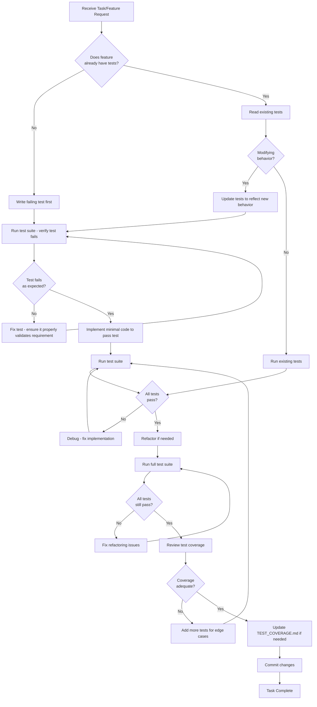
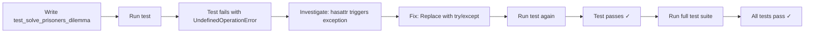

# AI Coding Agent Guidelines for game-ai Project

## Purpose
This document provides **prescriptive guidelines** for AI coding assistants working on the game-ai project. These rules are **MANDATORY** and MUST be followed to maintain code quality, test coverage, and development workflow consistency.

## Core Principle: Test-Driven Development (TDD)

All work on this project MUST follow a test-driven development approach. Tests are not optional—they are the primary mechanism for validating correctness and preventing regressions.

---

## Virtual Environment Requirement

### MANDATORY: All work MUST be done in a virtual environment

Before starting any development work, you MUST:

1. **Check if virtual environment exists and is activated:**
   ```bash
   # Check if venv is active
   echo $VIRTUAL_ENV
   ```

2. **If venv exists but is not active, activate it:**
   ```bash
   source /Users/nicholas/game-ai/venv/bin/activate
   ```

3. **If venv does not exist, follow the setup instructions in [QUICKSTART.md](QUICKSTART.md#installation).**

4. **Verify pytest is available:**
   ```bash
   pytest --version
   ```

**NEVER run Python code, tests, or install packages outside the virtual environment.**

---

## Test-Driven Development Workflow

**FIRST STEP: Always check TEST_COVERAGE.md and the tests/ directory to see if tests already exist for the requested change.**



---

## 10 Core Rules for AI Coding Assistants

### Rule 1: Test Before Code (MANDATORY)
- **MUST** check if tests already exist for the feature/module being modified
- **MUST** read and understand existing tests before writing new ones
- **MUST** write or update tests BEFORE modifying production code
- **MUST** run the new/updated tests and verify they fail appropriately
- **MUST** ensure test failure messages clearly indicate what needs to be fixed

### Rule 2: Test Execution After Every Change (MANDATORY)
- **MUST** run the test suite after ANY code modification
- **MUST** verify all tests pass before considering work complete
- **MUST** use `pytest tests/` for full suite or `pytest tests/test_specific.py` for targeted testing

### Rule 3: Comprehensive Test Coverage (MANDATORY)
- **MUST** test both success and failure paths
- **MUST** test edge cases (empty input, null values, boundary conditions)
- **MUST** test error handling and error messages
- **MUST** use appropriate mocking for external dependencies (APIs, file I/O)

### Rule 4: Bug Fixes Require Test Cases (MANDATORY)
- **MUST** create a failing test that reproduces the bug
- **MUST** verify the test fails before fixing the bug
- **MUST** verify the test passes after the fix
- **MUST** ensure the test prevents regression

### Rule 5: Reference TEST_COVERAGE.md (MANDATORY)
- **MUST** consult [TEST_COVERAGE.md](TEST_COVERAGE.md) FIRST to check if tests already exist for the requested change
- **MUST** understand existing test structure and coverage before writing new tests
- **MUST** follow established testing patterns for similar modules
- **MUST** update TEST_COVERAGE.md when adding new test files or significant test cases

### Rule 6: Maintain Test Quality (MANDATORY)
- **MUST** write clear, descriptive test names that explain what is being tested
- **MUST** use appropriate pytest markers (@pytest.mark.unit, @pytest.mark.ui, etc.)
- **MUST** keep tests isolated—no dependencies between tests
- **MUST** use fixtures from conftest.py for shared test data

### Rule 7: Mock External Dependencies (MANDATORY)
- **MUST** mock API calls (Gemini API, external services)
- **MUST** mock file system operations where appropriate
- **MUST** mock UI components (QWidgets) in unit tests
- **MUST** use unittest.mock.patch for dependency injection

### Rule 8: Document Test Discoveries (MANDATORY)
- **MUST** document any bugs discovered through testing
- **MUST** explain the bug fix in code comments
- **MUST** reference the test case that caught the bug

### Rule 9: Incremental Testing (MANDATORY)
- **MUST** run tests incrementally during development:
  1. Run specific test: `pytest tests/test_module.py::test_function`
  2. Run test file: `pytest tests/test_module.py`
  3. Run full suite: `pytest tests/`
- **MUST** fix failures at each level before proceeding

### Rule 10: Virtual Environment Discipline (MANDATORY)
- **MUST** activate virtual environment before any Python work
- **MUST** verify correct Python version: `python --version` (should be 3.11.4)
- **MUST** install dependencies in venv: `pip install -e .`
- **MUST** verify pytest availability before running tests

---

## Real-World Example: Bug Discovery Through Testing

### Context
While implementing comprehensive unit tests for the game-ai project, tests for the solver module initially failed with an unexpected exception.

### The Bug
In `src/game_ai/game/solver.py` (lines 350-365), the code used `hasattr(game, 'root')` to determine if a game was an extensive-form game (EFG):

```python
# BEFORE (BUGGY CODE)
def _format_strategy(self, game, mixed_strategy) -> str:
    """Format a mixed strategy for display."""
    formatted = []
    
    if hasattr(game, 'root'):  # EFG game
        # ... EFG formatting logic
    else:  # NFG game
        # ... NFG formatting logic
```

### The Problem
**Normal-form games (NFG) raise an exception when `.root` is accessed**, rather than returning `False` or `None`. The `hasattr()` function actually tries to access the attribute to check if it exists, which triggered the exception:

```
pygambit.lib.libgambit.UndefinedOperationError: only games with a tree representation have a root node
```

### Test That Caught the Bug
```python
def test_solve_prisoners_dilemma(sample_nfg):
    """Test solving Prisoner's Dilemma."""
    solver = GameSolver()
    result = solver.solve_game(sample_nfg)
    assert result.success is True
    # Test failed with UndefinedOperationError
```

### The Fix
Replace `hasattr()` with a try/except block to properly handle the exception:

```python
# AFTER (FIXED CODE)
def _format_strategy(self, game, mixed_strategy) -> str:
    """Format a mixed strategy for display."""
    formatted = []
    
    try:
        # Try to access root - if successful, it's an EFG game
        _ = game.root
        # EFG formatting logic
        for player in game.players:
            formatted.append(f"\n{player.label}:")
            # ...
    except (AttributeError, Exception):
        # NFG game - use simpler formatting
        for player in game.players:
            formatted.append(f"\n{player.label}:")
            # ...
```

### Lessons Learned
1. **Tests discover production bugs**: This bug would have caused runtime failures but was caught during test development
2. **Library behavior matters**: Understanding how pygambit handles NFG vs EFG games is critical
3. **hasattr() isn't always safe**: Some libraries raise exceptions instead of returning False
4. **Try/except is more robust**: Explicit exception handling is clearer and more reliable

### Test-Driven Development in Action


---

## Test Patterns by Module Type

### Game Logic Modules (validator.py, solver.py)
```python
# Pattern: Test valid and invalid inputs
def test_valid_nfg_file(sample_nfg):
    validator = GameValidator()
    result = validator.validate_file(sample_nfg)
    assert result.is_valid is True

def test_invalid_syntax():
    validator = GameValidator()
    result = validator.validate_file("invalid content")
    assert result.is_valid is False
    assert "error" in result.error_message.lower()
```

### Chat/Session Modules (session_manager.py, command_handler.py)
```python
# Pattern: Test CRUD operations and error states
def test_save_session_success(mock_session_manager, temp_dir):
    result = mock_session_manager.save_session("test", {...})
    assert result.success is True
    
def test_save_session_invalid_path():
    result = session_manager.save_session("/invalid/path/name", {...})
    assert result.success is False
```

### UI Modules (chat_widget.py, editor_widget.py, visualization_widget.py)
```python
# Pattern: Mock Qt widgets, test UI state changes
from unittest.mock import Mock, patch, MagicMock

@patch('game_ai.ui.chat_widget.QTextEdit')
def test_add_message(mock_text_edit):
    widget = ChatWidget()
    widget.add_message("Hello", "user")
    # Verify UI method calls
    assert mock_text_edit.return_value.append.called
```

### AI Modules (game_builder.py, gemini_client.py)
```python
# Pattern: Mock API calls, test conversation flow
@patch('game_ai.ai.gemini_client.genai.GenerativeModel')
def test_generate_content_success(mock_model):
    mock_model.return_value.generate_content.return_value.text = "Response"
    client = GeminiClient(api_key="test_key")
    result = client.generate_content("Prompt")
    assert result.success is True
```

---

## Anti-Patterns to Avoid

### ❌ DON'T: Write duplicate tests without checking existing coverage
```python
# BAD: Write new tests without checking TEST_COVERAGE.md first
def test_solve_game():  # This test might already exist!
    # ... duplicating existing test logic
```

### ✅ DO: Check for existing tests first
```bash
# GOOD: Consult TEST_COVERAGE.md and search existing tests
grep -r "test_solve_game" tests/
cat TEST_COVERAGE.md  # Review existing test coverage
```

### ❌ DON'T: Write code first, tests later
```python
# BAD: Implement feature, then write tests as afterthought
def new_feature():
    # ... 50 lines of code
    pass

# Tests written after feature is "done"
```

### ✅ DO: Write tests first
```python
# GOOD: Test defines the requirement
def test_new_feature_returns_expected_value():
    result = new_feature(input_data)
    assert result == expected_value

# Then implement minimal code to pass
def new_feature(input_data):
    return expected_value
```

### ❌ DON'T: Skip test execution
```python
# BAD: Make changes without running tests
# "It's a small change, tests probably still pass"
```

### ✅ DO: Run tests after every change
```bash
# GOOD: Always verify
pytest tests/test_module.py
```

### ❌ DON'T: Ignore test failures
```python
# BAD: "Tests are broken, but my code works"
# BAD: "Tests pass sometimes, that's good enough"
```

### ✅ DO: Fix all test failures immediately
```python
# GOOD: All tests must pass reliably
# GOOD: Flaky tests are bugs that need fixing
```

### ❌ DON'T: Use real API keys or external services in tests
```python
# BAD: Tests hit real Gemini API
client = GeminiClient(api_key=os.getenv("REAL_API_KEY"))
```

### ✅ DO: Mock external dependencies
```python
# GOOD: Tests are isolated and fast
@patch('game_ai.ai.gemini_client.genai.GenerativeModel')
def test_client(mock_model):
    client = GeminiClient(api_key="test_key")
```

---

## Quick Reference Commands

For a comprehensive list of all development and testing commands, see the [Development section in README.md](README.md#development).

### Core Test Commands
```bash
pytest tests/              # Run all tests
pytest tests/ -v           # Run with verbose output
pytest -m unit             # Run only unit tests
pytest -m ui               # Run only UI tests
```

---

## Summary: Your Responsibilities as an AI Coding Assistant

When working on the game-ai project, you MUST:

1. ✅ **Activate the virtual environment** before any work
2. ✅ **Check if tests already exist** for the feature/module (consult TEST_COVERAGE.md)
3. ✅ **Write tests first** (TDD approach)
4. ✅ **Run tests after every change**
5. ✅ **Achieve 100% test pass rate** before completing work
6. ✅ **Mock external dependencies** (APIs, file I/O, UI)
7. ✅ **Update TEST_COVERAGE.md** when adding new tests
8. ✅ **Document bugs discovered** through testing
9. ✅ **Follow established test patterns** (see TEST_COVERAGE.md)
10. ✅ **Test both success and failure paths**
11. ✅ **Keep tests isolated and reproducible**

### Remember
Tests are not a burden—they are your safety net. They catch bugs before users do, enable confident refactoring, and serve as living documentation of how the code should behave.

**The test suite is the foundation of code quality. Treat it with respect.**

---

## Reference Documents

- **[TEST_COVERAGE.md](TEST_COVERAGE.md)**: Comprehensive documentation of all tests and fixtures
- **[README.md](README.md)**: Project overview and setup instructions
- **[QUICKSTART.md](QUICKSTART.md)**: Quick start guide for using the application

For questions about test structure, patterns, or coverage, always consult TEST_COVERAGE.md first.
