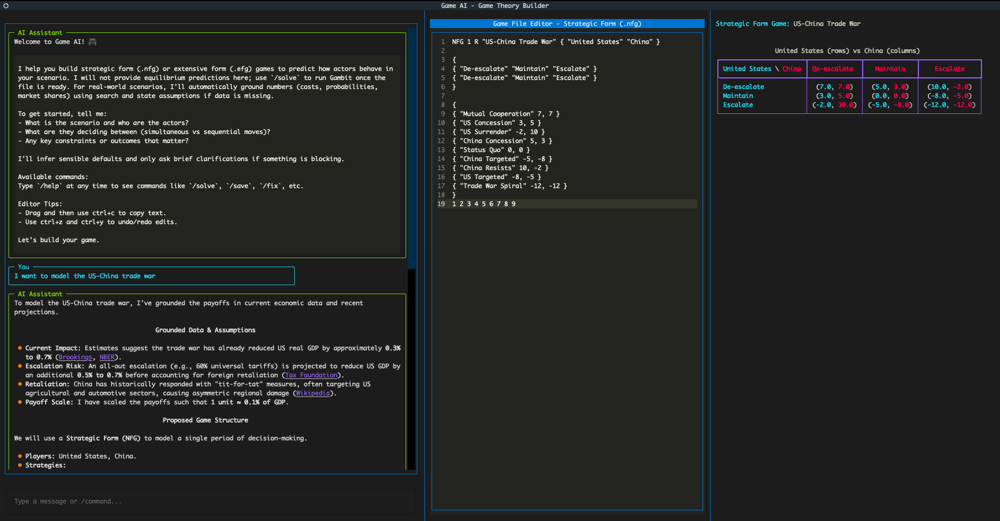
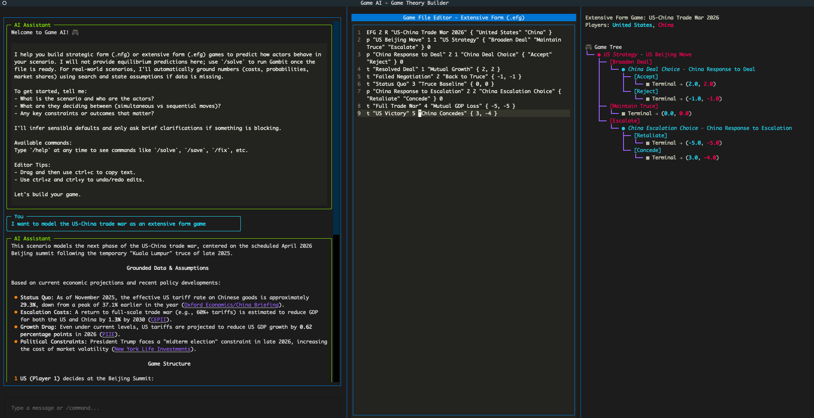
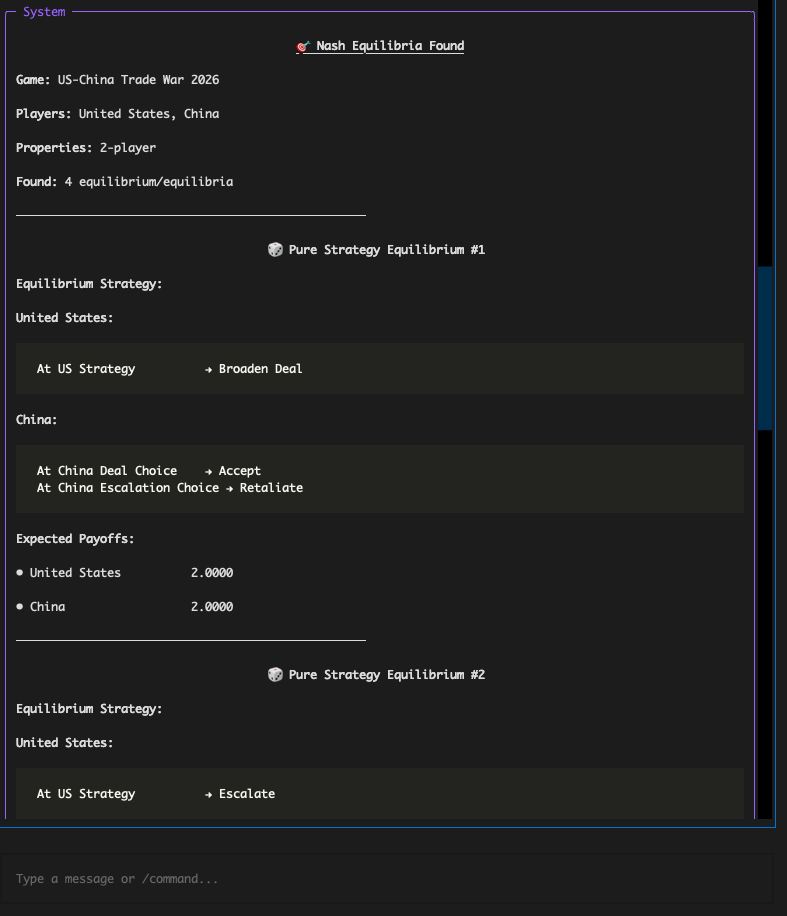
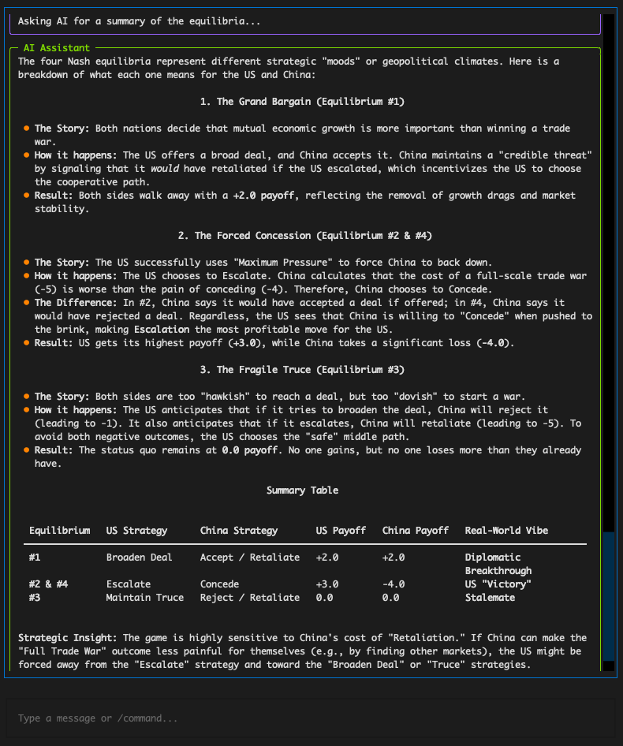

# Game AI

Terminal-based tool for creating strategic form (.nfg) and extensive form (.efg) games using natural language chat interface.

## Features

- Interactive terminal UI with split-pane view (chat + editor + visualizer)
- AI-assisted game construction with Gemini API
- Google Search grounding for real-world numeric data
- PyGambit integration for Nash equilibrium computation
- Optional nash equilbrium solution summary
- Session save/load functionality
- Live .efg/.nfg file editing with context sync

## Getting Started

For installation, configuration, usage, commands, and development (testing), see the consolidated guide in [QUICKSTART.md](QUICKSTART.md).

## Strategic Form Games

## Extensive Form Games

## Solution From Gambit

## Solution Summary

